# React Performance

The "React Performance" task delves into techniques and best practices to optimize the performance of React applications.

In this task, it was necessary to fetch data from a huge JSON file ([file](https://nyc3.digitaloceanspaces.com/owid-public/data/co2/owid-co2-data.json)) containing CO2 emissions data by countries. It was also required to implement Year Selection, Filtering, Sorting, and Search, and finally to optimize the application using useMemo, useCallback, React.memo, and proper key props for lists and tables.

## Performance Profiling Task

Parameters to Check:

- **Commit Duration:** Time taken for React to render the committed updates.
- **Render Duration:** Time taken for individual components to render.
- **Interactions:** User interactions that triggered the renders.
- **Flame Graph:** Visual representation of component render times.
- **Ranked Chart:** Sorted list of components by render duration.

## Before optimization

### Year Selection

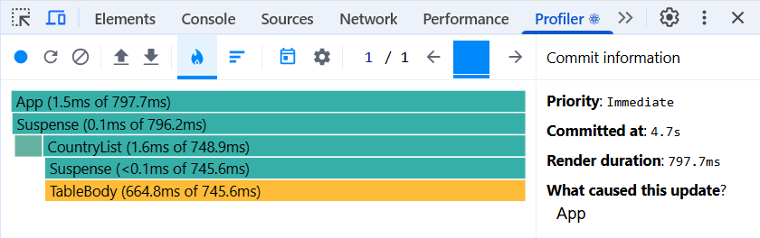
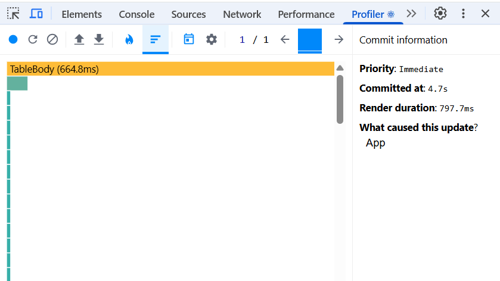

### Adding columns

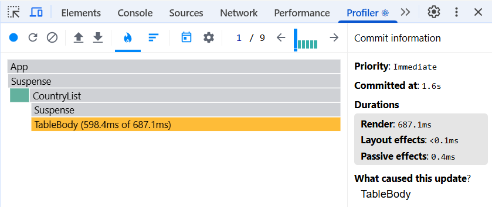
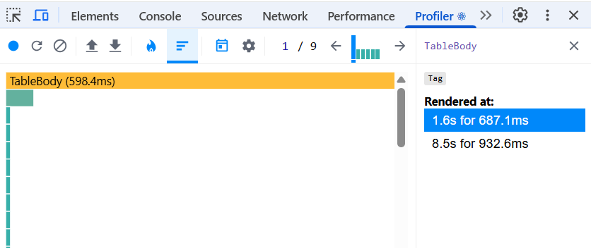

### Search

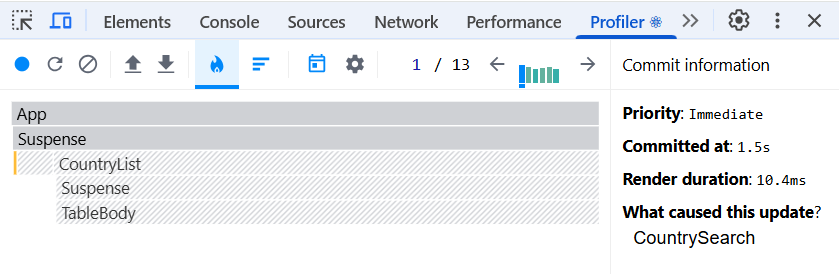
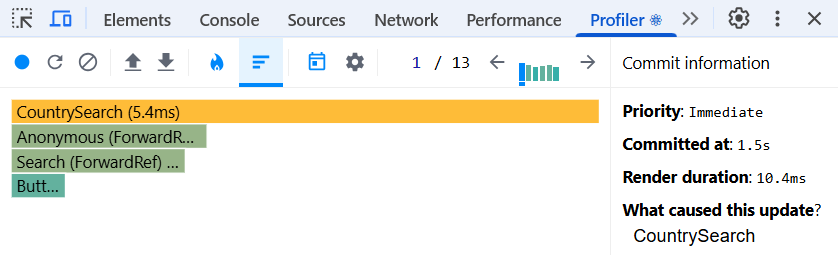

### Sort countries by population

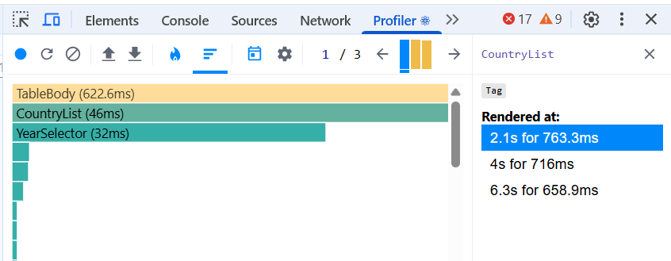
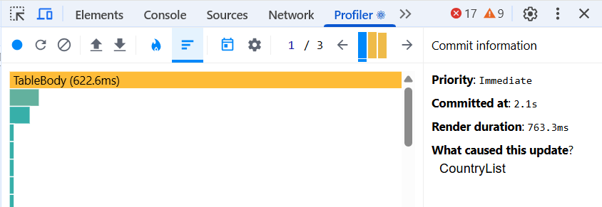

## After optimization

### Year Selection

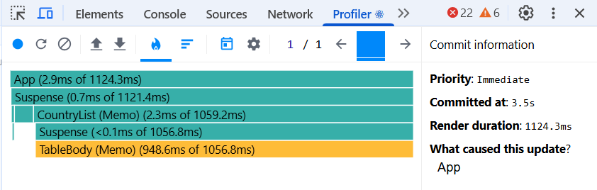
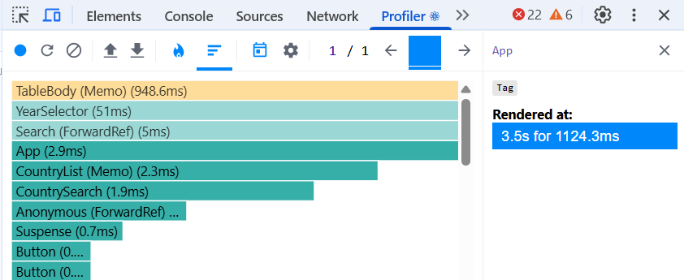

### Adding columns

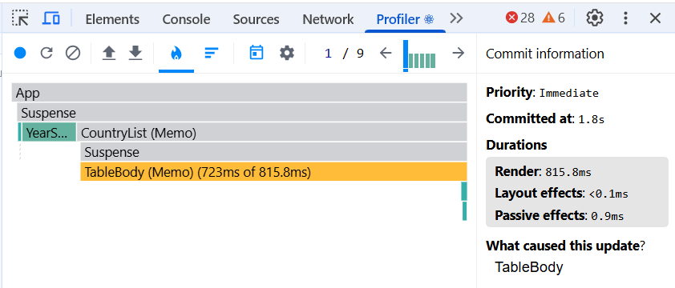
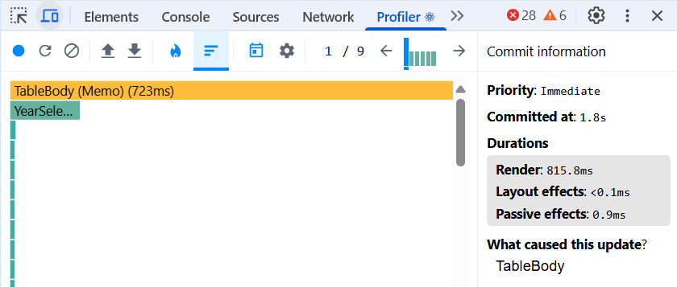

### Search

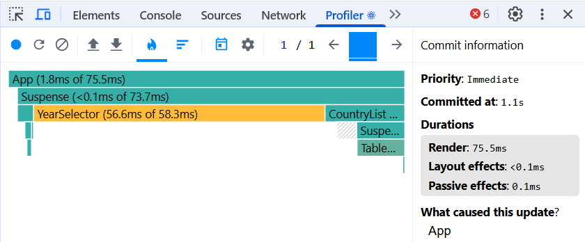
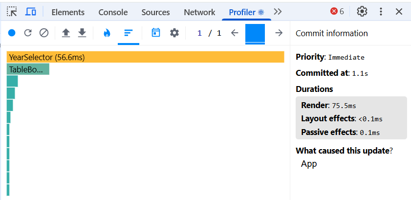

### Sort countries by population

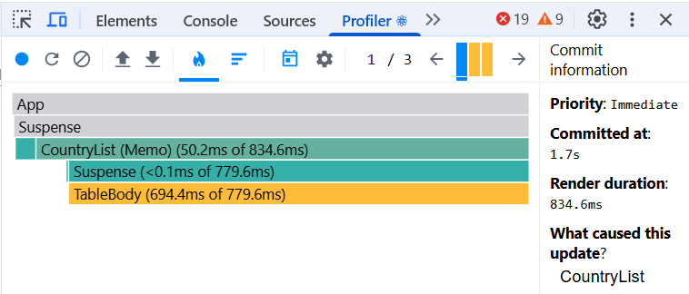
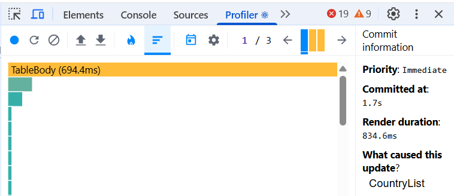
